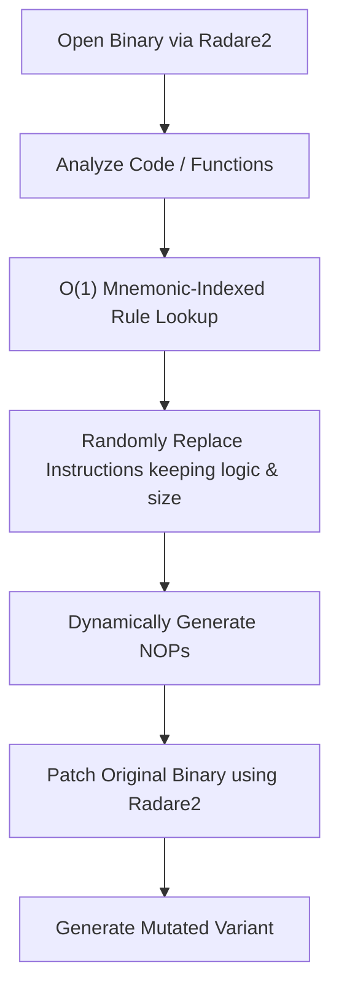

# 🌀 metame

> A highly optimized metamorphic code mutation engine for arbitrary executables (x86/x64).

[](https://www.python.org/)
[](https://opensource.org/licenses/MIT)
[](setup.py)

---

## 💡 What is Metamorphic Code?

> **Metamorphic code** is code that, when run or compiled, outputs a logically equivalent version of itself. In cybersecurity, this technique is typically used to evade signature-based detection mechanisms (like anti-virus pattern recognition) by ensuring the binary looks completely different on every generation while retaining the exact same logic and functionality.

---

## ✨ Features

- **🚀 Highly Optimized Execution**:
  - **$O(1)$ Mnemonic Indexing**: Grouping substitution rules by opcode mnemonics for instant lookup instead of scanning linear lists.
  - **Dynamic NOP Replacement**: Generates random NOP sequences dynamically on-the-fly rather than rebuilding/recompiling patterns inside hot-paths.
  - **🛡️ Flag & Register Safe NOPs**: Leverages native CPU multi-byte NOPs (e.g. `nop dword ptr [rax]`) and relative branch jumps to guarantee EFLAGS/RFLAGS stability and prevent register contamination.
  - **📏 Correct Size-Constrained Mutators**: Resolves 64-bit REX instruction size expansions and relative branch jumps to ensure strict instruction-size preservation during mutation.
- **🖥️ Architecture Support**: Fully supports **x86 (32-bit)** and **x64 (64-bit)** instructions.
- **📦 Multi-Format Support**: Leverages [radare2](http://radare.org/) for file parsing and assembly analysis, supporting PE, ELF, Mach-O, and more.
- **🛡️ Safe Assembler Execution**: Exception boundaries around the Keystone assembler ensure stability.

---

## 🆕 Key Changes & Improvements (v0.5 vs. Legacy v0.4)

This modernized version introduces major performance, stability, compatibility, and logic improvements over the old unmaintained version (`metame_old` / v0.4):

- **⚡ $O(1)$ Mnemonic Indexing**: Grouping substitution rules by opcode mnemonics allows instant lookup during instruction scans, replacing slow linear searches over all rules.
- **🔄 Dynamic & Smart NOP Sleds**: Placeholder resolution (`{nop1}`, `{nop2}`, etc.) generates NOP sequences dynamically based on the exact target memory address to keep relative branch jumps correct.
- **🛡️ Flag-Safe & Register-Safe NOPs**: Employs multi-byte CPU NOP instructions (e.g. `nop dword ptr [rax]`) and safe exchange operations (`xchg ax, ax`) rather than flag-altering instructions or ESP/RSP-altering push/pop sequences.
- **➕ Expanded Metamorphic Rules**: Adds logic swaps for branch aliases (`je`/`jz`, `jne`/`jnz`), flag-safe arithmetic expansions (`add reg, 1` $\leftrightarrow$ `inc reg`), and `shl` expansions.
- **🌐 Modern Radare2 Compatibility**: Resolves crashes by supporting both `"offset"` and `"addr"` fields in JSON output from modern versions of `radare2`. Opcode normalization ensures parsing handles varying spacing/casing gracefully.
- **🐛 Error Resilience**: Corrects a bug where disassembling a single corrupted function would crash the entire metamorphic iteration. Added target path validation and cleaner error outputs.
- **🧪 Automated Test Coverage**: Integrates a complete test suite to assert correctness on both 32-bit and 64-bit platforms.

---

## ⚙️ How It Works



1. **Disassemble & Analyze**: Opens the input executable with `radare2` to load symbol metadata and function offsets.
2. **Mutate Opcodes**: Scans each instruction, instantly queries candidate replacement patterns, and chooses a random matching sequence of equivalent size.
3. **Patch & Save**: Copies the original file and overwrites the target instruction offsets with the newly assembled metamorphic bytes.

---

## 📊 Mutation Examples

### Example 1: Instruction Mutation
*Can you spot the difference between the original and mutated assembly?*


> [!TIP]
> Two instructions were replaced in the snippet above to modify signature bytes while preserving behavior.

### Example 2: NOP Sled Refactoring
*Mutating static NOP sleds into a variety of random operations.*


---

## 🚀 Installation

### From Source (Recommended)
This codebase contains critical fixes for compatibility with modern versions of `radare2` (which use the `"addr"` field instead of `"offset"` in JSON output). Installing from source is highly recommended:

**Developer Mode (Recommended)**:
Installs the package in editable mode. Any changes to the source code are reflected immediately without re-installing:
```bash
pip install -e .
```

**Regular Local Install**:
```bash
pip install .
```

### From PyPI
> [!WARNING]
> The version on PyPI (`0.5`) may be outdated and raise errors like `Keystone assembly failed ...: 'offset'` when used with modern `radare2` versions.
```bash
pip install metame
```

### Prerequisites
- **[radare2](http://radare.org/)**: Used for binary analysis. Please make sure it is installed and available on your system's `PATH`. Supports both older (`"offset"`) and newer (`"addr"`) JSON structures.
- **`simplejson`** (Optional performance boost):
  ```bash
  pip install simplejson
  ```

---

## 📖 Usage

Run the engine from the command line:

```bash
metame -i original.exe -o mutation.exe -d
```

### Options
- `-i`, `--input`: Path to the input file to mutate.
- `-o`, `--output`: Path to save the mutated file.
- `-d`, `--debug`: Print detailed replacement logs.
- `-f`, `--force`: Force instruction replacement even if it reduces metamorphism entropy.

Use `metame -h` for a full list of commands.

---

## 📄 License

This project is licensed under the **MIT License**. See the `LICENSE` file for details.
