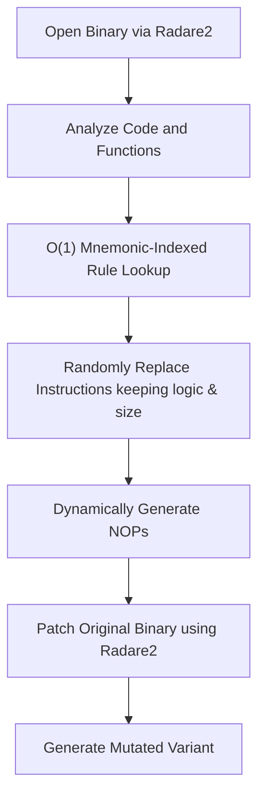

# metame

> A highly optimized metamorphic code mutation engine for arbitrary executables supporting x86 and x64 architectures.

[](https://www.python.org/)
[](https://opensource.org/licenses/MIT)
[](setup.py)

---

## What is Metamorphic Code?

Metamorphic code is code that, when run or compiled, outputs a logically equivalent version of itself. In software security and analysis, this technique is typically used to evade signature-based detection mechanisms by ensuring the binary structure looks completely different on every generation while retaining the exact same program logic and runtime behavior.

---

## Key Features

* **High Performance Engine Optimization**
  * **O(1) Mnemonic Indexing:** Substitution rules are categorized and indexed by opcode mnemonics at startup. This enables instant lookup during translation instead of traversing linear lists.
  * **Dynamic NOP Sled Refactoring:** Generates random NOP sequences dynamically on-the-fly rather than pulling from pre-compiled hardcoded lists.
  * **EFLAGS and Register Stability:** Employs multi-byte NOPs (such as `nop dword ptr [rax]`) and relative branch jumps to guarantee CPU flag stability and prevent register contamination.
  * **Strict Size-Constrained Mutators:** Accounts for 64-bit REX prefix instruction size expansions and relative branch offsets to ensure exact size equivalence.

* **Broad Binary Compatibility**
  * **Architecture Support:** Fully supports x86 (32-bit) and x64 (64-bit) instructions.
  * **File Formats:** Leverages radare2 to support parsing and modification of ELF, PE, Mach-O, and raw binary formats.
  * **Modern radare2 Compatibility:** Fully compatible with newer versions of radare2 utilizing both `"addr"` and `"offset"` json outputs.

* **Robust Logic and Safety**
  * **Safe Assembly Boundaries:** Leverages exception boundaries around the Keystone assembler to guarantee process stability.
  * **Validation Suite:** Integrated unit tests verifying register safety, instruction normalization, and size constraints.

---

## Architecture and Mutation Pipeline



1. **Disassemble and Analyze:** The binary is processed by radare2 to retrieve symbol metadata and function offsets.
2. **O(1) Opcode Query:** Every candidate instruction is matched against our pre-indexed dictionary of instruction patterns.
3. **Equivalence Replacement:** The engine randomly selects a substitution that matches the exact original byte length.
4. **Binary Patching:** The original file is duplicated and patched with the new metamorphic bytes.

---

## Mutation Examples

### Instruction Mutation

Original and mutated assembly comparisons:


> [!TIP]
> Two instructions were replaced in the snippet above to modify signature bytes while preserving behavior.

### NOP Sled Refactoring

Mutating static NOP sleds into a variety of random operations:


---

## Installation

### Prerequisites
* **radare2:** Required for binary parsing and code analysis. Ensure radare2 is installed and added to the system PATH.
* **simplejson:** (Optional) Recommended to accelerate JSON processing.
  ```bash
  pip install simplejson
  ```

### Install from Source (Recommended)
This repository contains critical compatibility fixes for newer releases of radare2. Installing directly from source is recommended.

To install in editable (Developer) mode:
```bash
pip install -e .
```

To install as a standard local package:
```bash
pip install .
```

### Install from PyPI
```bash
pip install metame
```

> [!WARNING]
> The version on PyPI may be outdated and raise errors like `Keystone assembly failed ...: 'offset'` when used with modern radare2 versions.

---

## Usage

Run the engine from your command line terminal:

```bash
metame -i original.exe -o mutation.exe -d
```

### CLI Arguments

| Flag | Long Option | Description |
|---|---|---|
| `-i` | `--input` | Path to the target input file to mutate |
| `-o` | `--output` | Path to write the mutated binary |
| `-d` | `--debug` | Print verbose logs and intermediate assembly replacements |
| `-f` | `--force` | Force replacement even if it reduces metamorphic entropy |

To see a complete list of commands, run:
```bash
metame -h
```

---

## Development and Verification

Run the test suite to verify changes, particularly after updating mutation patterns:
```bash
python -m unittest discover tests
```

---

## License

This project is licensed under the MIT License. See the `LICENSE` file for details.
