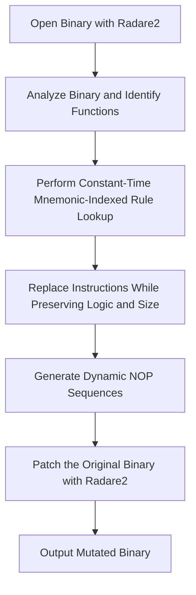

<p align="center">
  
</p>

> A highly optimized metamorphic code mutation engine for arbitrary executables (x86/x64).

---

## What is Metamorphic Code?

Metamorphic code is code that, when run or compiled, outputs a logically equivalent version of itself. In cybersecurity, this technique is typically used to evade signature-based detection mechanisms (like anti-virus pattern recognition) by ensuring the binary looks completely different on every generation while retaining the exact same logic and functionality.

---

## Key Features in Version 0.5

The latest release of metame introduces substantial optimizations, architecture enhancements, and compatibility fixes.

### Highly Optimized Execution
* **Constant Time Mnemonic Indexing:** Substitution rules are indexed by opcode mnemonics for O(1) lookup speed, replacing slow linear rule scans.
* **Dynamic NOP Placeholder Resolution:** Generates random NOP sequences dynamically on-the-fly, allowing relative branch jumps to be resolved correctly at patch time.
* **Safe Registers and Flags:** Leverages native multi-byte NOPs (such as `nop dword ptr [rax]`) and relative branch jumps to guarantee EFLAGS/RFLAGS stability and prevent register contamination.
* **Size-Constrained Mutators:** Resolves instruction size expansions and relative branch jumps to ensure strict instruction-size preservation during mutation.

### Expanded Mutation Logic
* **Arithmetic substitutions:** Mutates `add reg, 1` to `inc reg` (and vice-versa) with appropriate NOP padding.
* **Bitwise shift expansion:** Mutates `shl reg, 1` to `add reg, reg`.
* **Control flow branch swapping:** Swaps branch aliases like `je` to `jz`, and `jne` to `jnz`.

### Modern Toolchain Compatibility
* **Radare2 Integration:** Supports both older (`offset`) and modern (`addr`) JSON structures returned by newer versions of radare2.
* **Opcode Normalization:** Standardizes whitespace and formatting differences from radare2 output for robust regex matching.

---

## Version 0.5

| Feature / Metric | Version (0.5) |
| :--- | :--- |
| **Rule Lookup Complexity** |  O(1) lookup via mnemonic-indexed dictionary |
| **Architecture Support** |  Optimized x86 / x64 with size-constrained mutators |
| **radare2 Compatibility** |  Robust (checks both `offset` and `addr` properties) |
| **NOP Generation** | Dynamic (generated on-the-fly relative to current address) |
| **Instruction Alignment** | Strict size-constrained resolution with validation |
| **Mutation Entropy** | Higher (shuffles and tries all equivalents) |
| **Testing** | Automated unit tests covering all handlers |

---

## How It Works



1. **Disassemble and Analyze:** Opens the input executable with `radare2` to load symbol metadata and function offsets.
2. **Mutate Opcodes:** Scans each instruction, queries candidate replacement patterns instantly, and chooses a random matching sequence of equivalent size.
3. **Patch and Save:** Copies the original file and overwrites the target instruction offsets with the newly assembled metamorphic bytes.

---

## Signature Mutation Verification

### Before Metamorphic Transformation
The original executable is detected by **65 out of 69** antivirus engines on VirusTotal, representing the baseline binary before metamorphic mutation.


> [!TIP]
> The original executable retains its initial binary signature, allowing signature-based antivirus engines to identify it consistently.

### After Metamorphic Transformation
After applying the metamorphic engine, the executable produces a completely different binary signature while preserving the original program behavior. The transformed sample is detected by **47 out of 69** antivirus engines, demonstrating that the signature bytes have been successfully modified.


> [!TIP]
> The SHA-256 hash changes entirely after metamorphic transformation, confirming that the binary signature has been altered while maintaining semantic equivalence and executable functionality.

---

### Detection Comparison

| Sample | SHA-256 | VirusTotal Detection |
| :--- | :--- | :---: |
| **Before Transformation** | `a3d5715a81f2fbeb5f76c88c9c21eeee87142909716472f911ff6950c790c24d` | **65 / 69** |
| **After Transformation** | `e3b5efb94c68a0a909f733153168cc4c3026562bb95692cbddbd7994fd14f0f1b` | **47 / 69** |

> [!NOTE]
> The metamorphic transformation reduced VirusTotal detections by **18 engines** (approximately **27.7% fewer detections**) while preserving the executable's original functionality. This demonstrates successful mutation of signature bytes without changing program semantics.

## Installation

### From Source (Recommended)
This codebase contains critical fixes for compatibility with modern versions of radare2. Installing from source is highly recommended.

**Developer Mode:**
Installs the package in editable mode. Any changes to the source code are reflected immediately:
```bash
pip install -e .
```

**Regular Local Install:**
```bash
pip install .
```

### From PyPI
> [!WARNING]
> The version on PyPI (0.4v) may be outdated and raise errors like `Keystone assembly failed ...: 'offset'` when used with modern radare2 versions.
```bash
pip install metame
```

### Prerequisites
* **radare2:** Used for binary analysis. Please make sure it is installed and available on your system PATH.
* **simplejson** (Optional performance boost):
  ```bash
  pip install simplejson
  ```

---

## Usage

Run the engine from the command line:

```bash
metame -i original.exe -o mutation.exe -d
```

### Options
* `-i`, `--input`: Path to the input file to mutate.
* `-o`, `--output`: Path to save the mutated file.
* `-d`, `--debug`: Print detailed replacement logs.
* `-f`, `--force`: Force instruction replacement even if it reduces metamorphism entropy.

Use `metame -h` for a full list of commands.

---

## License

This project is licensed under the MIT License. See the LICENSE file for details.
