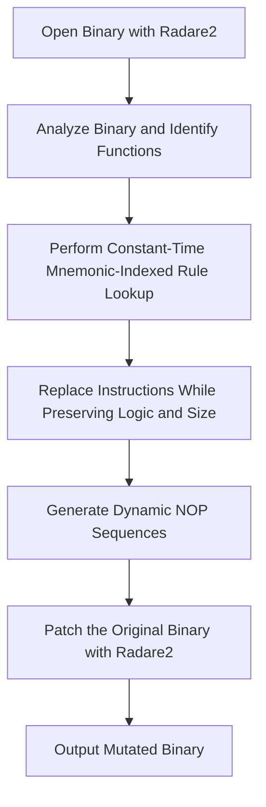
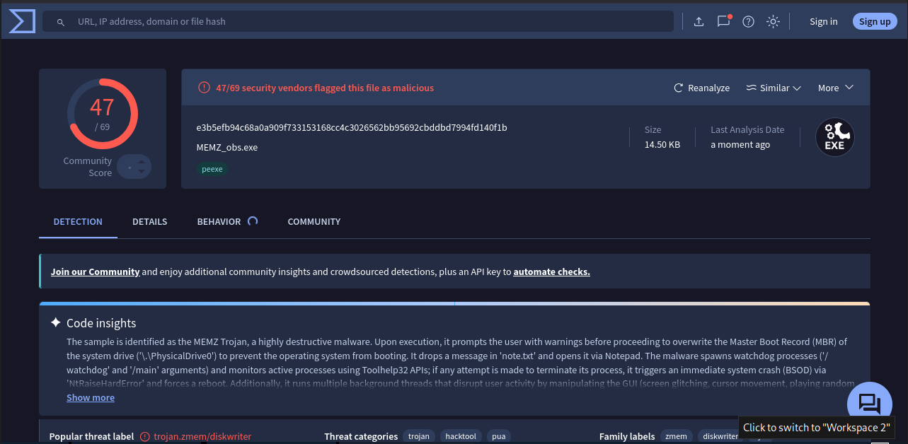
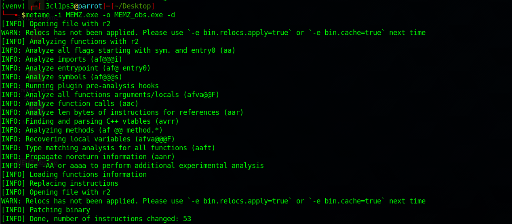

<p align="center">
  
</p>

> A highly optimized, size-constrained metamorphic code mutation engine for arbitrary executables (x86/x64).

---

## 📖 Table of Contents
- [What is Metamorphic Code?](#what-is-metamorphic-code)
- [Key Features](#key-features)
- [How It Works](#how-it-works)
- [Under the Hood](#under-the-hood)
  - [1. Mnemonic-Indexed Rule Lookup](#1-mnemonic-indexed-rule-lookup)
  - [2. Size-Constrained Mutation](#2-size-constrained-mutation)
  - [3. Dynamic & Safe NOP Generation](#3-dynamic--safe-nop-generation)
- [Supported Instruction Mutations](#supported-instruction-mutations)
  - [32-bit (x86) Mutator Rules](#32-bit-x86-mutator-rules)
  - [64-bit (x64) Mutator Rules](#64-bit-x64-mutator-rules)
- [NOP Generation Catalog](#nop-generation-catalog)
  - [32-Bit NOP Sequences](#32-bit-nop-sequences)
  - [64-Bit NOP Sequences](#64-bit-nop-sequences)
- [Signature Mutation Verification](#signature-mutation-verification)
- [Installation](#installation)
  - [Prerequisites](#prerequisites)
  - [From Source (Recommended)](#from-source-recommended)
  - [From PyPI](#from-pypi)
  - [Docker Setup](#docker-setup)
- [Usage](#usage)
  - [Command-line Options](#command-line-options)
  - [Example Mutation Command](#example-mutation-command)
- [License](#license)

---

## What is Metamorphic Code?

Metamorphic code is code that, when run or compiled, outputs a logically equivalent version of itself. In cybersecurity, this technique is typically used to evade signature-based detection mechanisms (such as antivirus pattern recognition) by ensuring the binary looks completely different on every generation while retaining the exact same logic and functionality.

---

## Key Features

* **O(1) Mnemonic Indexing:** Substitution rules are indexed by opcode mnemonics for constant-time lookup, replacing slow linear rule scans.
* **Size-Constrained Mutators:** Resolves instruction size expansions and relative branch jumps to ensure strict instruction-size preservation during mutation.
* **Dynamic NOP Placeholder Resolution:** Generates random NOP sequences dynamically on-the-fly, allowing relative branch jumps to be resolved correctly at patch time.
* **Safe Registers & Flags:** Uses native multi-byte NOPs (such as `nop dword ptr [rax]`) and relative branch jumps to guarantee EFLAGS/RFLAGS stability and prevent register contamination.
* **Modern Radare2 Integration:** Supports both older (`offset`) and modern (`addr`) JSON structures returned by newer versions of radare2.
* **Opcode Normalization:** Standardizes whitespace and formatting differences from radare2 output for robust regex matching.

---

## How It Works

`metame` uses `radare2` to disassemble the input binary and analyze its functions. It then identifies instructions that match its library of replacement patterns, compiles alternatives using the `keystone-engine`, and patches the binary.



1. **Disassemble and Analyze:** Opens the input executable with `radare2` to load symbol metadata and function offsets.
2. **Mutate Opcodes:** Scans each instruction, queries candidate replacement patterns instantly, and chooses a random matching sequence of equivalent size.
3. **Patch and Save:** Copies the original file and overwrites the target instruction offsets with the newly assembled metamorphic bytes.

---

## Under the Hood

The execution logic is split into several core components:
- [__init__.py](metame/__init__.py): Coordinates argument parsing, input/output validation, and controls the parser iterations.
- [r2parser.py](metame/r2parser.py): Establishes `r2pipe` connections, parses binary target metadata, performs functions analysis, and applies patch blocks.
- [x64handler.py](metame/x64handler.py): Houses the transformation engine, NOP generators, compilation abstractions via Keystone Engine, and mutation definitions.
- [constants.py](metame/constants.py): Declares architecture target support limits.

### 1. Mnemonic-Indexed Rule Lookup
Earlier versions of metamorphic engines scanned mutation rules linearly. `metame` indexes rules by the mnemonic of the first instruction (e.g., `mov`, `add`, `xor`). During iteration, it checks the dictionary in $O(1)$ time to quickly verify if the instruction is a candidate for mutation.

### 2. Size-Constrained Mutation
For binary patching to be safe without rewriting the entire relocation table, mutated instructions must occupy the exact same byte length as the original instruction(s). `metame` handles this by compiling candidate instructions using Keystone Engine:
- If the mutated instruction is too short, it appends NOP padding (e.g. `{nop1}`, `{nop2}`).
- If the mutated instruction matches the original byte length exactly, the patch is registered.
- If it cannot find a replacement of equal length, the instruction is left unmodified.

### 3. Dynamic & Safe NOP Generation
Standard single-byte NOPs (`0x90`) are easily identified by signatures. `metame` implements a dynamic NOP generator that constructs random multi-byte NOP sequences of lengths 1 to 4. To ensure that these NOPs do not break the program, they employ:
* **Flag Stability:** Wrapping state-changing operations inside `pushfd` / `popfd` to preserve processor flags.
* **Register Stability:** Restricting pushed/popped registers to safe subsets and immediately restoring them.
* **Control Flow Jumps:** Using relative jumps (e.g. `jmp addr+offset`) to skip over mutating helper instructions.
* **Intel/AMD Long NOPs:** Utilizing multi-byte NOP instructions like `nop dword ptr [rax]` which perform no operation and do not affect flags.

---

## Supported Instruction Mutations

Detailed mutation behavior is defined inside [x64handler.py](metame/x64handler.py).

### 32-bit (x86) Mutator Rules
The engine checks for the following patterns and replaces them with one of the equivalents:

| Original Pattern | Target Equivalents / Explanations |
| :--- | :--- |
| `mov reg, reg` | Replaced by NOP sequence of length 2 |
| `add reg, 1` | `inc reg` + NOP padding |
| `sub reg, 1` | `dec reg` + NOP padding |
| `shl reg, 1` | `add reg, reg` |
| `test reg, reg` | `or reg, reg` (and vice-versa) |
| `xor reg, reg` | `sub reg, reg` (and vice-versa) |
| `mov regA, regB` | `push regB; pop regA` |
| `mov reg, 0` | `pushfd; xor reg, reg; popfd; {nop1}`<br>`pushfd; sub reg, reg; popfd; {nop1}`<br>`pushfd; and reg, 0; popfd` |
| `mov reg, 1` | `pushfd; xor reg, reg; inc reg; popfd` |
| `mov reg, IMM8` | `push IMM8; pop reg; {nop2}`<br>`{nop2}; push IMM8; pop reg`<br>`{nop1}; push IMM8; {nop1}; pop reg` |
| `je Target` / `jz Target` | Swaps between `je` and `jz` aliases |
| `jne Target` / `jnz Target` | Swaps between `jne` and `jnz` aliases |

### 64-bit (x64) Mutator Rules
Extends the x86 rules with specific 64-bit register mutations:

| Original Pattern | Target Equivalents / Explanations |
| :--- | :--- |
| `mov reg, reg` | Replaced by NOP sequence of length 2 |
| `add reg, 1` | `inc reg` + NOP padding |
| `sub reg, 1` | `dec reg` + NOP padding |
| `shl reg, 1` | `add reg, reg` |
| `test reg, reg` | `or reg, reg` (and vice-versa) |
| `xor reg, reg` | `sub reg, reg` (and vice-versa) |
| `add r_reg, 1` | `inc r_reg` + NOP padding |
| `sub r_reg, 1` | `dec r_reg` + NOP padding |
| `shl r_reg, 1` | `add r_reg, r_reg` |
| `test r_reg, r_reg` | `or r_reg, r_reg` (and vice-versa) |
| `xor r_reg, r_reg` | `sub r_reg, r_reg` (and vice-versa) |
| `mov r_regA, r_regB` | `push r_regB; pop r_regA; {nop1}`<br>`{nop1}; push r_regB; pop r_regA`<br>`push r_regB; {nop1}; pop r_regA` |
| `je Target` / `jz Target` | Swaps between `je` and `jz` aliases |
| `jne Target` / `jnz Target` | Swaps between `jne` and `jnz` aliases |

---

## NOP Generation Catalog

When `metame` needs to pad out instruction replacements, it selects a random sequence from the following tables depending on the target architecture and the required length in bytes.

### 32-Bit NOP Sequences

| Size (Bytes) | Mutation / Sequence Template | Safety & Mechanism |
| :---: | :--- | :--- |
| **1** | `nop` | Standard 1-byte instruction |
| **2** | `push reg; pop reg` | Pushes/pops a random register (`eax`, `ebx`, `ecx`, `edx`, `esi`, `edi`) |
| **2** | `pushad; popad` | Saves and restores all general-purpose registers |
| **2** | `xchg ax, ax` | Equivalent to standard NOP |
| **2** | `nop; nop` | Double NOP |
| **3** | `jmp addr+3; inc reg` | Jumps over the mutating register increment instruction |
| **3** | `jmp addr+3; push reg` | Jumps over the push instruction |
| **3** | `jmp addr+3; pop reg` | Jumps over the pop instruction |
| **3** | `nop dword ptr [eax]` | Native multi-byte long NOP |
| **3** | `nop; {nop2}` or `{nop2}; nop` | Combined 1-byte and 2-byte NOPs |
| **4** | `jmp addr+4; pop reg; pop reg` | Jumps over safe stack cleanup sequences |
| **4** | `jmp addr+4; push reg; push reg` | Jumps over register push operations |
| **4** | `jmp addr+4; push reg; pop reg` | Jumps over stack operations |
| **4** | `xor reg, 0; nop` | Mutates flags, leaves register intact |
| **4** | `nop dword ptr [eax + eax]` | Multi-byte long NOP using SIB byte |
| **4** | `{nop2}; {nop2}` | Combined two 2-byte NOPs |

### 64-Bit NOP Sequences

| Size (Bytes) | Mutation / Sequence Template | Safety & Mechanism |
| :---: | :--- | :--- |
| **1** | `nop` | Standard 1-byte instruction |
| **2** | `push reg; pop reg` | Pushes/pops a random register (`rax`, `rbx`, `rcx`, `rdx`, `rsi`, `rdi`) |
| **2** | `xchg ax, ax` | Multi-byte NOP |
| **2** | `nop; nop` | Double NOP |
| **3** | `push reg; pop reg; nop` | 2-byte register operations + NOP |
| **3** | `nop; push reg; pop reg` | NOP + 2-byte register operations |
| **3** | `jmp addr+3; push reg` | Jumps over instruction to preserve stack/register integrity |
| **3** | `nop dword ptr [rax]` | Native multi-byte long NOP |
| **3** | `nop; {nop2}` or `{nop2}; nop` | Combined NOPs |
| **4** | `jmp addr+4; pop reg; pop reg` | Jumps over stack modification |
| **4** | `jmp addr+4; push reg; push reg` | Jumps over register pushes |
| **4** | `jmp addr+4; push reg; pop reg` | Jumps over stack sequence |
| **4** | `jmp addr+4; pop reg; push reg` | Jumps over stack sequence |
| **4** | `add reg, 0` | Modifies flags, register remains unchanged |
| **4** | `nop dword ptr [rax + rax]` | 4-byte native NOP |
| **4** | `{nop2}; {nop2}` | Combined NOPs |

---

## Signature Mutation Verification

### Before Metamorphic Transformation
The original executable is detected by **65 out of 69** antivirus engines on VirusTotal, representing the baseline binary before metamorphic mutation.


> [!TIP]
> The original executable retains its initial binary signature, allowing signature-based antivirus engines to identify it consistently.

### After Metamorphic Transformation
After applying the metamorphic engine, the executable produces a completely different binary signature while preserving the original program behavior. The transformed sample is detected by **47 out of 69** antivirus engines, demonstrating that the signature bytes have been successfully modified.



> [!TIP]
> The SHA-256 hash changes entirely after metamorphic transformation, confirming that the binary signature has been altered while maintaining semantic equivalence and executable functionality.

### Detection Comparison

| Sample | SHA-256 | VirusTotal Detection |
| :--- | :--- | :---: |
| **Before Transformation** | `a3d5715a81f2fbeb5f76c88c9c21eeee87142909716472f911ff6950c790c24d` | **65 / 69** |
| **After Transformation** | `e3b5efb94c68a0a909f733153168cc4c3026562bb95692cbddbd7994fd14f0f1b` | **47 / 69** |

> [!NOTE]
> The metamorphic transformation reduced VirusTotal detections by **18 engines** (approximately **27.7% fewer detections**) while preserving the executable's original functionality. This demonstrates successful mutation of signature bytes without changing program semantics.

---

## Installation

### Prerequisites
* **radare2**: Used for binary analysis. Please make sure it is installed and available on your system `PATH`.
* **keystone-engine**: Assembly engine used for dynamic compilation of replacement sequences.
* **r2pipe**: Python interface to radare2.
* **simplejson** (Optional performance boost): Recommended for faster JSON parsing from radare2 command outputs.

### From Source (Recommended)
This codebase contains critical fixes for compatibility with modern versions of radare2. Installing from source is highly recommended.

**Developer Mode:**
Installs the package in editable mode. Any changes to the source code are reflected immediately:
```bash
pip install -e .
```

**Regular Local Install:**
```bash
pip install .
```

### From PyPI
> [!WARNING]
> The version on PyPI (0.4v) may be outdated and raise errors like `Keystone assembly failed ...: 'offset'` when used with modern radare2 versions.
```bash
pip install metame
```

### Docker Setup
To run `metame` within a containerized environment, use the provided [Dockerfile](Dockerfile). This automatically builds the environment with the correct Radare2, Keystone, and Python libraries:

```bash
docker build -t metame .
docker run -it metame
```

---

### Command-line Options

| Flag | Long Flag | Description |
| :---: | :--- | :--- |
| `-i` | `--input` | **[Required]** Path to the input binary to mutate. |
| `-o` | `--output` | **[Required]** Path to save the mutated binary. |
| `-d` | `--debug` | Enable detailed debug logs (prints instruction mapping/assembly mismatches). |
| `-f` | `--force` | Force instruction replacement even if it reduces metamorphic entropy. |
| `-h` | `--help` | Show the help message and exit. |

### Example Mutation Command

To mutate an executable with debug logging enabled:
```bash
metame -i original.exe -o mutated.exe -d
```

To force mutations where replacement candidates are limited:
```bash
metame -i original.exe -o mutated.exe -f
```

### Metamorphic Transformation Process

The metamorphic engine analyzes the executable using **radare2**, identifies candidate instructions, and applies semantics-preserving instruction substitutions to modify the binary signature without changing the program's behavior. In this example, the engine successfully patched the executable by replacing **~ instructions**, producing a new binary with a different signature while maintaining its original functionality.



> [!TIP]
> The output confirms that the metamorphic engine completed the transformation successfully, reporting **53 modified instructions**. These instruction-level mutations alter the executable's byte signature while preserving its semantic behavior, demonstrating the effectiveness of metamorphic code transformation.

---

## License

This project is licensed under the MIT License. See the [LICENSE](LICENSE) file for details.
